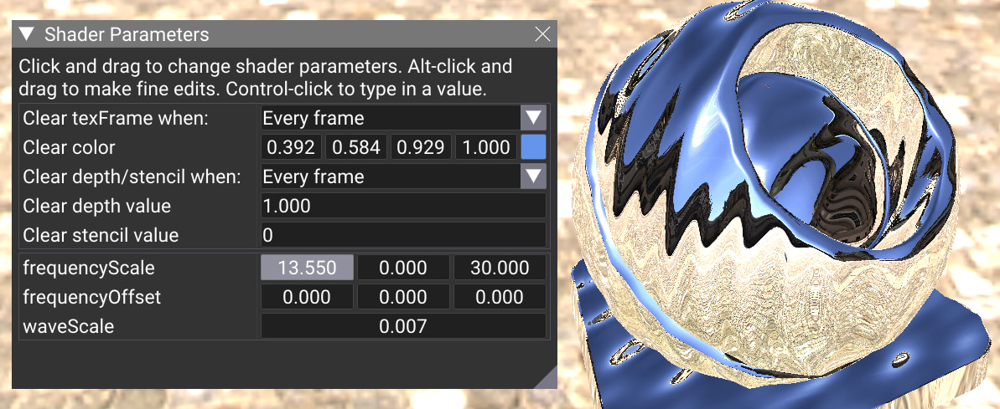
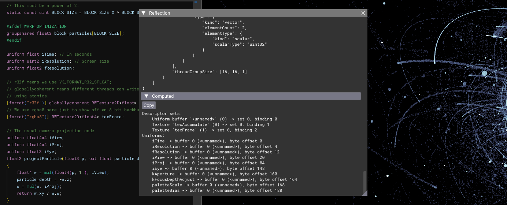
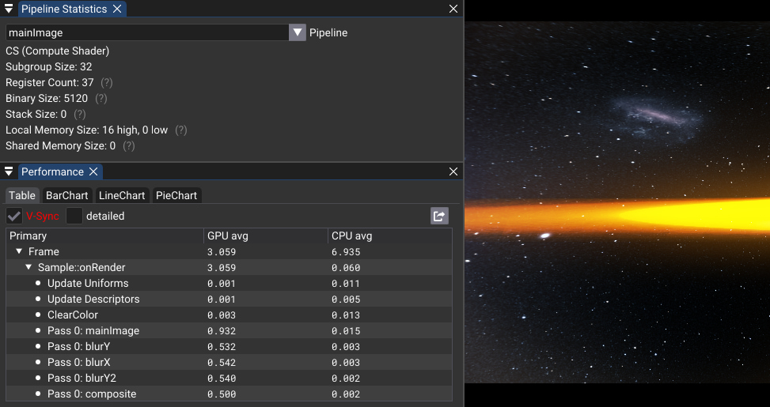

# vk_slang_editor

A shader-driven livecoding tool using Vulkan and the [Slang](https://shader-slang.org/) shading language. Download it [here](https://github.com/nvpro-samples/vk_slang_editor/releases)!


Vk_slang_editor lets you write Slang shaders, compile them, and quickly see and interact with the result. Notably, it lets you write multi-pass pipelines in a single file, add arbitrary shader parameters, load meshes and textures; and much more -- while Slang's language features can make writing complex or large shaders easier.

This editor was initially created for the SIGGRAPH 2025 *Introduction to Slang* interactive lab. You can download the lab slides covering topics from basics to generics [here](https://developer.download.nvidia.com/ProGraphics/nvpro-samples/SlangLab/Slides.pdf), and the full lab materials (including SlangPy files) [here](https://developer.download.nvidia.com/ProGraphics/nvpro-samples/SlangLab/Lab.zip)!

## Features



* **Shader reflection:**
  * Supports compute, vertex, fragment, hull, domain, and geometry shaders
  * vk_slang_editor automatically recognizes shader parameters named `iTime`, `iFrame`, `iResolution`, `iMouse`, `iView`, `iProj`, `texFrame`, and more, and will automatically write to them, converting to the data type used in the shader as needed
  * Pipelines and resources are defined inside shader code. If you need more offscreen buffers, for instance, adding another `RWTexture2D` to your global variables will create one!
  * Defining multiple entrypoints in a shader automatically combines them into passes and runs them every frame. This makes creating complex shader pipelines fast; for instance, see *Examples > Siggraph2025 > Solutions > 2 - Shader IO*, which implements a particle simulation with an acceleration structure for k-nearest-neighbor queries.
  * All unrecognized parameters will appear in the Shader Parameters GUI, so you can have as many sliders as you want to control your shader in real-time
  * Camera controls are automatically created when vk_slang_editor detects rasterization pipelines
  * Textures are automatically loaded from disk when they match file names
  * Built-in explorer for Slang reflection info



* **Performance analysis:**
  * The Performance pane shows how long each pass takes to run on the GPU or CPU, down to the microsecond
  * The Pipeline Statistics pane shows how many registers each shader uses, and much more depending on the shader type
  * Integrated SPIR-V disassembly pane
  * If your driver supports it, vk_slang_editor can even show assembly using VK_KHR_pipeline_executable_properties!



* **Editor:**
  * Built-in code editor powered by [goossens/ImGuiColorTextEdit](https://github.com/goossens/ImGuiColorTextEdit/)
  * Function docs and code completion using the Slang language server, `slangd`
  * Syntax coloring data is automatically extracted from Slang using `language_highlight_autogen.py`
  * Light, dark, and customizable color themes
  * Arbitrary UI scaling with crisp font rendering

![A screenshot of the shader editor. The cursor is inside the nv_cubic_solver.evaluateCubic() function, and the UI shows its docs -- "Evaluates sun(k[i] x^i, i in [0,3])". Additionally, the developer's typed in two letters -- "c" and "o" -- and the code completion UI suggests "coefficients" or maybe "coherent" or "col".](doc/editor.png)

* **And more!**
  * Comes with 14 example shaders covering topics including compute shaders, autodifferentiation, particle systems, and much more
  * Built-in Quick Reference pane for the editor and the Slang language
  * Uninitialized textures are filled with "UNINIT" text to help debug
  * Autosaving and crash handling support -- so even if you find a way to crash the editor, your work will always be saved.

## Cloning & Building

To download this repository, run `git clone` with the `--recursive` flag to download submodules like ImGuiColorTextEdit:

```
git clone --recursive https://github.com/nvpro-samples/vk_slang_editor.git
```

Or if you've already cloned the sample, you can get the correct version of all submodules by running this command inside the vk_slang_editor directory:

```
git submodule update --init --recursive
```

Once you've done that, vk_slang_editor can be built like most nvpro-samples. Please see the [nvpro_core2 page](https://github.com/nvpro-samples/nvpro_core2?tab=readme-ov-file#requirements) for instructions.

## Keyboard Shortcuts

* F3: Compile
* Text editor:
  * Arrow keys: Move cursor
  * Ctrl + right/left: Move cursor word by word
  * Ctrl + up/down: Move to top/bottom of document
  * Shift + arrow keys: Select range
  * Shift + Alt + right/left: Grow/shrink selection to curly braces
  * Shift + Home/End: Move to start/end of line
  * Ctrl+A: Select all
  * Ctrl+X / Shift+Delete: Cut
  * Ctrl+C / Ctrl+Insert: Copy
  * Ctrl+V / Shift+Insert: Paste
  * Ctrl+Z : Undo
  * Ctrl+Shift+Z / Ctrl+Y: Redo
  * Ctrl+D: Adds the next instance of the currently selected text to the selection
  * Delete: Delete to right of cursor
  * Backspace: Delete to left of cursor
  * Ctrl+Shift+K: Delete selected lines
  * Ctrl + `+` / Shift+Tab: Deindent lines
  * Ctrl + `-` / Tab (with selection): Indent lines
  * Alt + up: Move line up
  * Alt + down: Move line down
  * Ctrl + /: Toggle per-line comments
  * Ctrl+F: Open find/replace
  * Ctrl+Shift+F: With find/replace open but not focused, find all
  * Ctrl+G: With find/replace open but not focused, find next
  * Insert: Toggle overwrite mode
* Language server features:
  * Tab / Enter: Accept autocompletion
  * Escape: Exit autocompletion/function doc menus
  * Up / down: Scroll through autocompletions
  * Shift + left / Shift + right: Scroll through function docs
* ImGui:
  * Ctrl+Tab: Enter keyboard navigation mode / switch between panes
  * Arrow keys: Navigate between widgets
  * Enter: Enter widgets
  * Escape: Exit widgets / keyboard navigation mode

## How it Works

### Rendering

For rendering engineers, most of the interesting code inside vk_slang_editor will be inside `src/sample_render.cpp`.

Vk_slang_editor compiles shaders to SPIR-V at runtime using the `nvslang::SlangCompiler` helper for the Slang library:

```cpp
// In setup:
nvslang::SlangCompiler m_compiler;
// Selects SPIR-V; uses the spirv_1_6+vulkan_1_4 target;
// enables generating SPIR-V directly; forces GLSL `scalar` layout
m_compiler.defaultTarget();
// Specify emitting SPIR-V directly:
m_compiler.addOption({slang::CompilerOptionName::EmitSpirvDirectly, {slang::CompilerOptionValueKind::Int, 1}});
// Don't rename entrypoints to `main`:
m_compiler.addOption({slang::CompilerOptionName::VulkanUseEntryPointName, {slang::CompilerOptionValueKind::Int, 1}});
// Generate level 1 debug information, which embeds shader source code
// for debugging tools:
m_compiler.addOption({slang::CompilerOptionName::DebugInformation, {slang::CompilerOptionValueKind::Int, 1}});

// To compile:
bool compileOk = m_compiler.loadFromSourceString("editor", slangCode);
```

This compiles to lower-level Slang API code that looks like this. For full
details and error-checking code, please see nvslang/slang.cpp in nvpro_core2:

```cpp
// In setup:
SlangGlobalSessionDesc desc{.enableGLSL = true};
slang::createGlobalSession(&desc, m_globalSession.writeRef());

// Inside loadFromSourceString():
// Create the session
slang::SessionDesc desc{
    .targets                  = m_targets.data(),
    .targetCount              = SlangInt(m_targets.size()),
    .searchPaths              = m_searchPathsUtf8Pointers.data(),
    .searchPathCount          = SlangInt(m_searchPathsUtf8Pointers.size()),
    .preprocessorMacros       = m_macros.data(),
    .preprocessorMacroCount   = SlangInt(m_macros.size()),
    .allowGLSLSyntax          = true,
    .compilerOptionEntries    = m_options.data(),
    .compilerOptionEntryCount = uint32_t(m_options.size()),
};
m_globalSession->createSession(desc, m_session.writeRef());

// From source code to Slang module:
m_module = m_session->loadModuleFromSourceString(moduleName.c_str(), nullptr, slangSource.c_str(), diagnostics.writeRef());
CHECK_MODULE(m_module, diagnostics);

// Combine the module all entrypoints into a composed program
// (this and link() are optional, but we won't get reflection info if we don't
// do this. This is also where we'd do link-time specialization if we needed it):
const SlangInt32                               definedEntryPointCount = m_module->getDefinedEntryPointCount();
std::vector<Slang::ComPtr<slang::IEntryPoint>> entryPoints(definedEntryPointCount);
std::vector<slang::IComponentType*>            components(1 + definedEntryPointCount);
components[0] = m_module;
for(SlangInt32 i = 0; i < definedEntryPointCount; i++)
{
  m_module->getDefinedEntryPoint(i, entryPoints[i].writeRef());
  components[1 + i] = entryPoints[i];
}
Slang::ComPtr<slang::IComponentType> composedProgram;
SlangResult result = m_session->createCompositeComponentType(components.data(), components.size(),
                                                             composedProgram.writeRef(), diagnostics.writeRef());
CHECK_RESULT(result, diagnostics);
       
// From composite component type to linked program
result = composedProgram->link(m_linkedProgram.writeRef(), diagnostics.writeRef());
CHECK_RESULT(result, diagnostics);

// From linked program to SPIR-V
result = m_linkedProgram->getTargetCode(0, m_spirv.writeRef(), diagnostics.writeRef());
CHECK_RESULT(result, diagnostics);
```

Since vk_slang_editor's shaders are user-defined, it also checks the result with
spirv-val to catch some common Vulkan issues before we get to pipeline creation:

```c++
const spv_result_t spvResult = spvValidateWithOptions(m_spirvTools.CContext(), spvOptions, &binary, &spvDiagnostic);
```

> [!NOTE]
> Slang and the driver's shader compilers should not be considered safe against
> *untrusted* or *malicious* input. Vk_slang_editor assumes you're writing your
> own shaders or using the provided ones, but apps that run arbitrary
> user-generated shaders should take additional precautions.
> For instance, you might sandbox Slang and perhaps the renderer as well.
> Shadertoy, for example, can make use of browser's security guarantees (since
> ANGLE is fuzz-tested), but also has a layer of active moderation on shaders.
> In VRChat, custom shaders can be set to only show for friends.

In vk_slang_editor, the structure of rendering pipelines and shader I/O is
defined by the shader, which means that vk_slang_editor also has to generate
Vulkan pipelines, descriptor sets, and other info on the fly. Slang's reflection
features allow it to do this; the main challenge then for vk_slang_editor is to
translate reflection info to Vulkan objects and calls.

To get reflection info, we get the Slang component type followed by its layout:

```c++
slang::IComponentType* program = m_compiler.getSlangProgram();
assert(program);
slang::ProgramLayout* reflection = program->getLayout();
assert(reflection);
```

This includes a large amount of information -- resource bindings, struct layouts,
entrypoint info, and much more.

> [!NOTE]
> Different apps using Slang might choose totally different approaches to
> handling shader I/O; how vk_slang_editor does it is just one way!
> Slang provides the low-level reflection info; you get to decide what to build
> out of that.
> For instance, [Slang Playground](https://shader-slang.org/slang-playground/)
> is also shader-driven but uses custom attributes instead of matching on
> variable names; this also means it can define ranges and initialization values
> for shader parameters inside the shader attribute instead of depending on a
> Shader Parameters window. Other apps might define render graphs in separate
> UIs, use explicit bindings, and so on. Even below, you'll notice that
> vk_slang_editor uses a traversal-based approach reflection to find everything;
> for other apps, a [shader cursor](https://docs.shader-slang.org/en/latest/shader-cursors.html)
> approach where the app chooses what to write might be more appropriate.

Probably the best way to motivate the object building code is to start with the
render loop, which looks like this:

1. Upload resources that need to be uploaded or reinitialized
2. Update descriptor sets and uniform buffers (the latter uses [vkCmdUpdateBuffer()](https://registry.khronos.org/vulkan/specs/latest/man/html/vkCmdUpdateBuffer.html), so we don't need to store one uniform buffer per frame cycle)
3. Clear resources that need to be cleared
4. For each "pass" (VkPipeline and other info):
   1. Add layout transitions for resources as necessary
   2. Bind input buffers (if a rasterization pipeline)
   3. Bind and dispatch the pass' pipeline

> [!NOTE]
> In the render loop, filling the uniform buffers with data is slower than a
> fixed-binding-and-type approach because for each write we go through a `switch`
> statement and a possible data type conversion to the type that was specified
> in the shader.
> Ideally, we would use the reflection info to generate optimized assembly for
> this on the fly, but this is not currently implemented.

To make this as fast as possible, we'd like to build all pipelines,
descriptor sets, and instructions for what to write where ahead of time.
This is done in `buildResourcesFromReflection()`, which follows these main steps:

1. It calls `traverseVariableLayout()` to recursively traverse through the global variable layout and collect info about shader parameters, resources that exist, and where their values or descriptors should be written. In some cases it collects additional info about things like `[format("...")]` annotations the shader author might have included.
2. It collects entrypoints into passes (the algorithm for this is best described in the source code comments) and emits diagnostics if e.g. a pass contained a domain shader but not a hull shader.
3. It uses the `slang::IMetadata*` for each entrypoint to figure out which parameters are used by which passes. The main rendering loop will later use this to set up as few barriers as necessary.
4. For rasterization pipelines, it calls `traverseForVertexAttributes()` to find which vertex buffers are needed by each pass; this will later be used to set up the minimal number of vertex attributes needed for the input assembly stage.
5. It next iterates over shader parameters and resources and tries to recognize them. Some variables like `iTime` or `texFrame` are recognized by their names (and can be recognized with different prefixes as well); if textures aren't recognized, they're next checked to see if they match a file on disk and loaded via a texture cache if so.
6. Finally, it creates Vulkan descriptor layouts, sets, and pipelines. It uses [VK_EXT_extended_dynamic_state](https://registry.khronos.org/vulkan/specs/latest/man/html/VK_EXT_extended_dynamic_state.html) so that pipelines can be configured from the Shader Parameters view in a future update.

### Language Server Protocol Implementation

Vk_slang_editor uses the `slangd` language server to provide both code completion and function documentation. Like other language servers for languages like Rust and Python, `slangd` implements the standard [Language Server Protocol](https://microsoft.github.io/language-server-protocol/) implemented by Visual Studio Code and other editors, so you might be able to use it for these features in your IDE of choice.

Despite its name, the language server runs entirely locally -- `slangd` (when run with no arguments or with `--stdio`) is really only an executable that receives [JSON-RPC messages](https://www.jsonrpc.org/) with HTTP headers over `stdin` and responds over `stdout`. So, for instance, if on Windows you run `slangd` in a terminal and type in

```json
Content-Length: 108

{"jsonrpc": "2.0", "id": 0, "method": "initialize", "params": {"clientInfo": {"name": "vk_slang_editor"}}}
```

followed by 2 newlines, `slangd` will respond with a similar Content-Length header followed by the JSON for an [InitializeResult](https://microsoft.github.io/language-server-protocol/specifications/lsp/3.17/specification/#initializeResult) object. (Typing that into a console won't work on Linux because the Language Server Protocol uses an HTTP header, which requires `\r\n` line endings.)

Vk_slang_editor's Language Server Protocol client implementation, as well as associated GUI, is contained within `src/language.cpp`. The best way to see how it works, though, might be to define the `SERVER_VERBOSE` preprocessor macro in `src/language.cpp`. Vk_slang_editor will then print every message sent and received over the language server protocol to the terminal.

If the language server ever crashes, vk_slang_editor will automatically restart it after a certain amount of time has passed (which can be configured in Editor > Editor Settings > Language Server > Minimum restart interval). In Debug mode, vk_slang_editor will also save a log of all language server protocol messages.

## Acknowledgements

The fractal flame shader appearing in some of the screenshots above is based off
of and modified from wrighter's tutorial here: https://wrighter.xyz/blog/2023_08_17_flame_fractals_in_comp_shader . It and
other shaders building off of previous work include credits in their comments.

Vk_slang_editor is inspired by other shader editing and livecoding tools like
[Bonzomatic](https://github.com/Gargaj/Bonzomatic)/[Bonzomatic-Compute](https://github.com/wrightwriter/Bonzomatic-Compute),
[Shadertoy](https://www.shadertoy.com/), [Gigi](https://github.com/electronicarts/gigi),
[compute.toys](https://compute.toys/), [FX Composer](https://developer.nvidia.com/fx-composer),
[Fragmentarium](https://syntopia.github.io/Fragmentarium/), [SHADERed](https://shadered.org/)
and more. Vk_slang_editor innovates in some areas like reflection, performance
analysis, and language server support, but lacks features like the social aspect
of Shadertoy, the network support of Bonzomatic, or the non-linear graphs and
C++ code generation of Gigi.